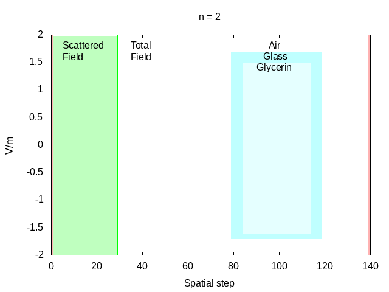

# openFDTD 

An open source program to simulate electromagnetic
signals and interactions with materials. 

## Overview
The simulations employ the FDTD method, on a staggered
grid as formulated by Kane S. Yee.

## Dependencies
The following dependencies are required to render the GUI.
- [Dear ImGui](https://github.com/ocornut/imgui)
- OpenGL 3
- GLFW 3

## Installation

In order to run this program, clone the repository and
from the top directory run:

```bash
cmake -S . -B build
cmake --build build/
```

The binary file `openFDTD` is generated in the project's
`bin` directory.

## Gallery
||
|:--:|
| *1D FDTD with TFSF, material, and 1st order Mur ABC* |

## Planned Features
* One dimension
  - [x] Simple propagation
  - [x] Simple Mur boundary conditions
  - [x] Total Field - Scattered Field formulation
  - [x] Materials in grid
  - [x] Automatic calculation of required parameters
  - [x] Specral analysis
  - [ ] Lossy materials
  - [ ] More sophisticated boundary conditions
* Two dimension
* Three dimension
  - [ ] Implement a mesher for 3D objects (ex: `.stl` file to cubic grid)
* General
  - [ ] Create a GUI
