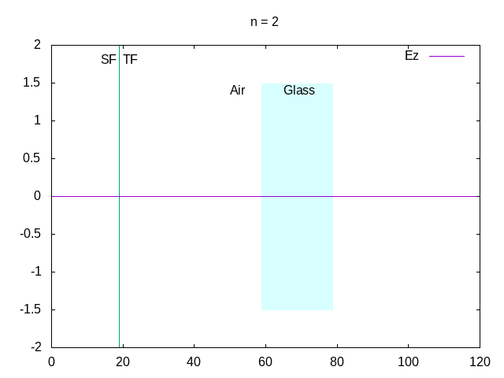

# openFDTD 

A free and open source program to simulate electromagnetic
signals and interactions with materials. 

The simulations employ the FDTD method, on a staggered
grid as formulated by Kane S. Yee.

## Installation

In order to run this program, clone the repository
and enter the build directory

```bash
cd build
cmake ..
make
```

The binary file is generated in the project's `bin`
directory.

## Gallery
||
|:--:|
| *1D FDTD with TFSF, material, and 1st order Mur ABC* |

## Features
* One dimension
  - [x] Simple propagation
  - [x] Simple Mur boundary conditions
  - [x] Total Field - Scattered Field formulation
  - [x] Materials in grid
  - [ ] Automatic calculation of required parameters
  - [ ] Specral analysis
  - [ ] More sophisticated boundary conditions
* Two dimension
  - *TODO* 
* Three dimension
  - *TODO* 
* General
  - [ ] Create a GUI
  - [ ] Implement a more sophisticated mesher
